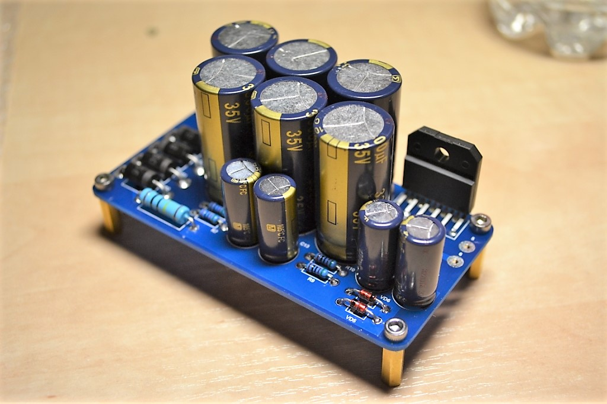

## LM3886 + AD825

### Description
Simple inverting lm3886 amplifier with ad825 buffer

### Links
- [https://vk.com/lm3886](https://vk.com/lm3886)
- [https://diyaudio.by/audio/amplifiers/usilitel-lm3886-ad825/](https://diyaudio.by/audio/amplifiers/usilitel-lm3886-ad825/)
- [http://forum.vegalab.ru/showthread.php?t=56985](http://forum.vegalab.ru/showthread.php?t=56985)
- [http://forum.vegalab.ru/showthread.php?t=58364](http://forum.vegalab.ru/showthread.php?t=58364)

### Authors
- Schematic design - [Audiomaniac]()
- PCB design - [Vitali Semashkevich](https://www.linkedin.com/in/vit-sema/)

### Links
- [http://forum.vegalab.ru/showthread.php?t=56985](http://forum.vegalab.ru/showthread.php?t=56985)
- [http://forum.vegalab.ru/showthread.php?t=58364](http://forum.vegalab.ru/showthread.php?t=58364)

### Buy parts for assembling
- [Order PCB from PCBWay](https://www.pcbway.com/project/shareproject/lm3886_ad825_1.html)

### Folder structure
Most folder names are self explanatory.
- 3d - contains 3d models of PCB
- bom - contains the bill of materials
- docs - contains drawings and images outputs of schematic and PCB files, assembling manuals
- firmware - contains compiled binary files
- gerbers - contains zip file of the PCB Gerbers and drill drawings for manufacture
- images - contain photo of assembling prototype
- pcb - contains the original schematic and PCB design files (Altium Designer,  KiCAD, SprintLayout, etc)
- soft - contains custom software using, for example, for operate with this device 
- source - contains project souce code (sketchs for Arduino, files C/C++, etc)